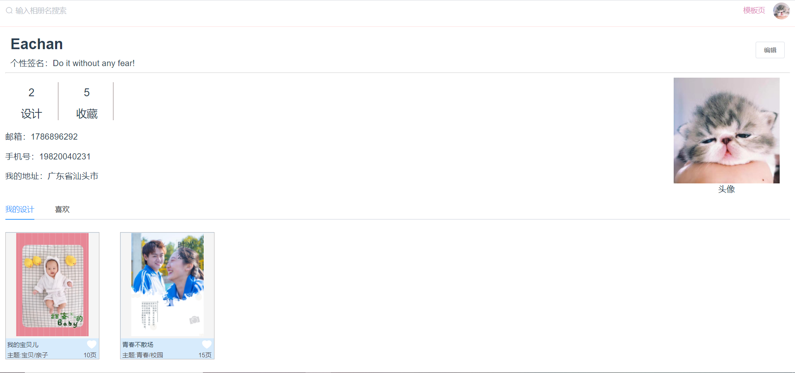
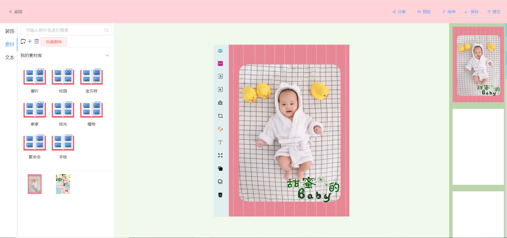
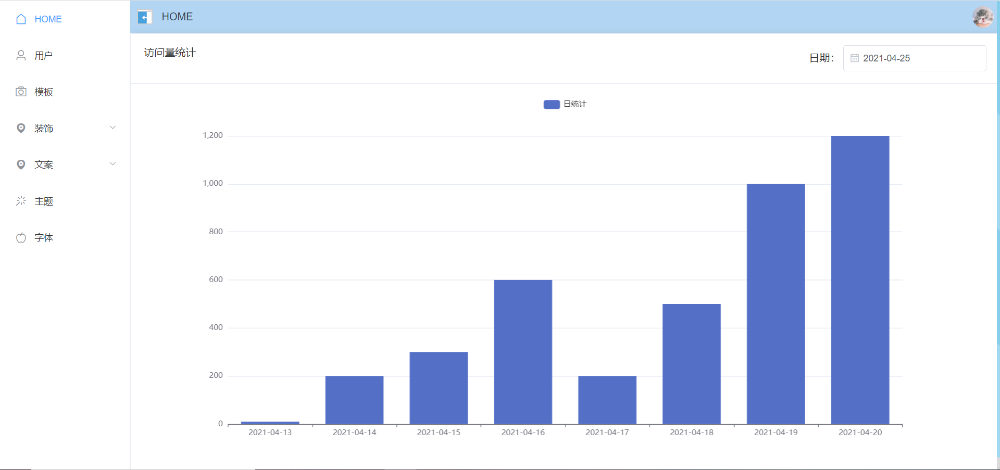
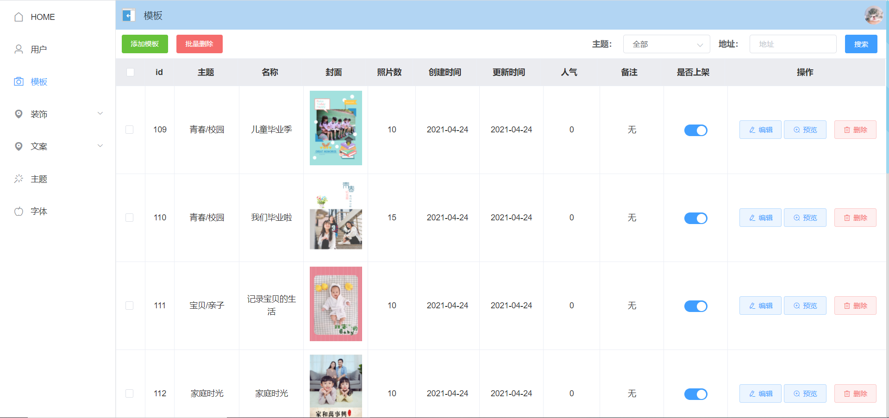
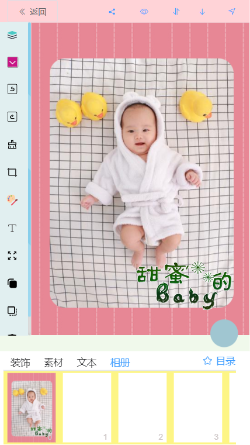

# TimeBook

Time Book is a book to record the time you want to restore in a instresting style. 

## Development

TimeBook is built at January 1st,2021 and I still try my best to finist it better step by step.It has a canvas with many features like Photo Shop and it can be use on both PC or mobile terminal.And the system  can use by any user who had sign out in the system.If you are interesting in it, so happy to invite you to fork it and finish with me~

## Here are some of Examples
### 用户端(PC端)

<h5 align="center">图1 模板页（用户首页）</h5>  
   

<h5 align="center">图2 个人中心</h5>  


<h5 align="center">图3 相册设计页</h5> 

### 后台管理（在此只列举2个）

<h5 align="center">图7 后台管理 首页</h5>  


<h5 align="center">图8 后台管理之模板管理</h5>  

### 用户端（H5端）  

<h5 align="center">图4 模板页（用户首页）</h5> 

  
<h5 align="center">图5 个人中心</h5>  


<h5 align="center">图6 相册设计页 </h5>  

## Build Setup

``` bash
# install dependencies
npm install

# serve with hot reload at localhost:8080
npm run dev

# build for production with minification
npm run build

# build for production and view the bundle analyzer report
npm run build --report
```
